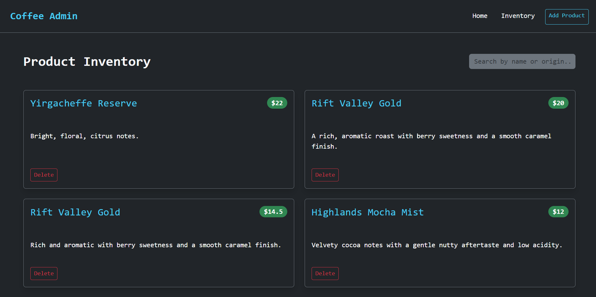
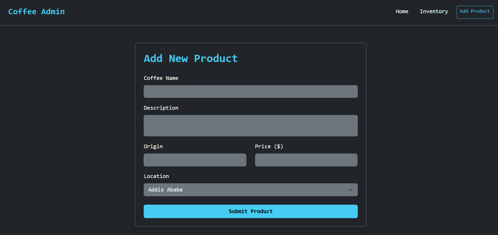

# Coffee Admin Portal - React SPA

## Overview
This project is a React-based Single Page Application (SPA). It serves as an administrative dashboard for an e-commerce coffee website, allowing users to view, add, search, and delete specialty coffee inventory. 

The application demonstrates proficiency in advanced React concepts, including state management, custom hooks, client-side routing, and simulated backend interactions using a JSON server.

**The Landing page**<br>


**The Form**<br>


## Key Features
* **Full CRUD Operations:** Seamlessly read, create, and delete coffee products interacting with a simulated backend.
* **Dynamic Search:** Real-time, highly optimized search functionality using React's `useMemo` hook to filter inventory without unnecessary re-renders.
* **Client-Side Routing:** Built with React Router to provide smooth, instantaneous navigation between the Landing Page, Inventory Dashboard, and Add Product form.
* **Custom Hooks:** Implements a robust `useProducts` hook to abstract fetch logic, manage loading/error states, and handle `AbortController` cleanup.
* **Enhanced UI/UX:** Styled responsively with Bootstrap 5 and features non-blocking notifications via React-Toastify and deletion confirmations via SweetAlert2.

## Technologies Used
* **Frontend:** React (initialized via Vite), React Router DOM
* **Styling & UI:** Bootstrap 5, React-Toastify, SweetAlert2
* **Backend Simulation:** JSON Server
* **Testing:** Vitest, React Testing Library, Jest-DOM

---

## Installation & Setup

**1. Clone the repository:**
```
git clone https://github.com/penina26/coffee-admin.git
cd coffee-admin
```
**2. Install dependencies:**
```
npm install
```

---
## Running the Application

This project is configured to run both the Vite frontend development server and the JSON Server backend simultaneously using a single command.

**Start the development environment:**<br>
```
npm start
```
* *(Note: This triggers the concurrently script defined in the package.json, spinning up the React app on Vite's default port and the JSON Server on http://localhost:3001)*

**Running the Test Suite**<br>
This application includes a testing suite built with Vitest and React Testing Library to verify component rendering, form validation, and simulated user interactions.<br>
**Execute the tests:**<br>
```
npm run test
```
---
## Project Structure

```text
coffee-admin/
├── public/
├── src/
│   ├── components/
│   │   ├── ProductForm.jsx
│   │   └── __tests__/
│   │       └── ProductForm.test.jsx
│   ├── hooks/
│   │   └── useProducts.js
│   ├── pages/
│   │   ├── AdminPage.jsx
│   │   ├── LandingPage.jsx
│   │   ├── ProductListPage.jsx
│   │   └── __tests__/
│   │       └── LandingPage.test.jsx
│   ├── App.jsx
│   ├── main.jsx
│   └── setupTests.js
├── db.json
├── package.json
├── vite.config.js
└── README.md
```